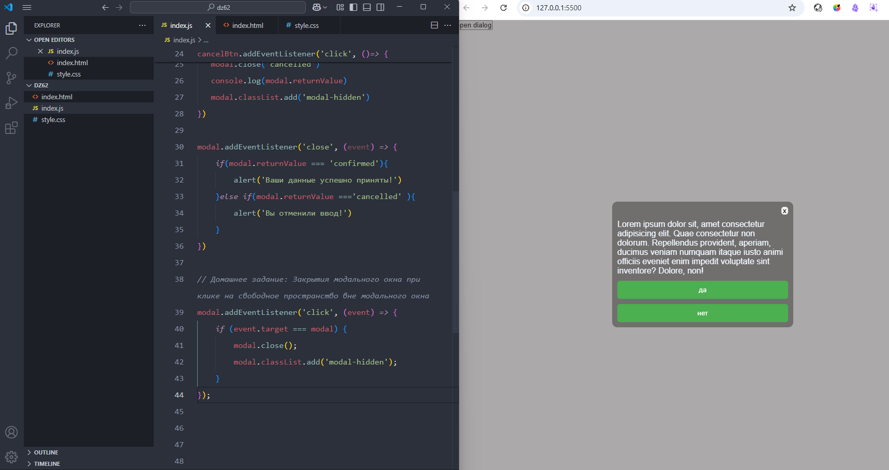

#### Домашнее задание:

  К выполненному проекту “Модальное окно dialog” необходимо добавить функционал закрытия модального окна при клике на свободное пространство вне модального окна. Для выполнения данного задания необходимо использовать код с урока.
  


Добавил код:
```js
modal.addEventListener('click', (event) => {
   if (event.target === modal) {
      modal.close();
      modal.classList.add('modal-hidden');
   }

})
```
но закрытие модального окна работало не совсем корректно, оно закрывалось если нажать на пространство между кнопками, ниже второй кнопки, сбоку кнопок, вверху текста. 

Поэтому изменил немного HTML: добавил `div class="modal-body"`  в который поместил все содержимое модального окна. И соответственно изменил CSS.