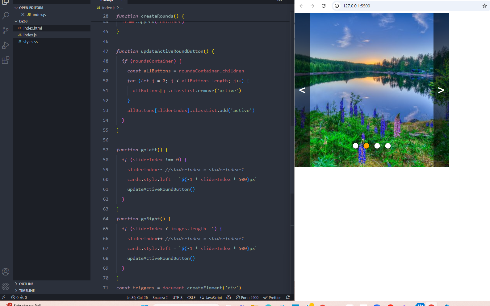

#### Домашнее задание:

  Для выполнения данного задания необходимо использовать код с урока “Создание галереи - слайдера”

В приложении есть баг: если пользователь сперва воспользуется навигацией по кнопкам rounds и кликнет на одну из них, а потом воспользуется навигацией по кнопкам triggers, то стили кнопок rounds работать не будут, а выделенный round останется на своем месте. Необходимо этот баг исправить.
  
