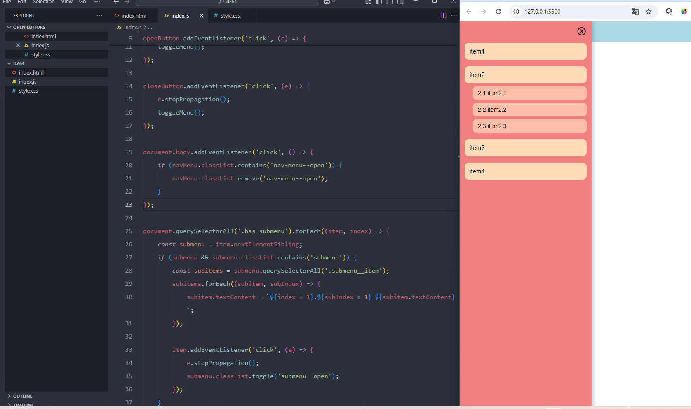

#### Домашнее задание:

Для выполнения данного задания необходимо использовать код с урока “Создание анимированного навигационного меню”

Добавить подпункты меню таким образом чтобы при клике на любой пункт меню снизу появились еще два-три подраздела.
  
